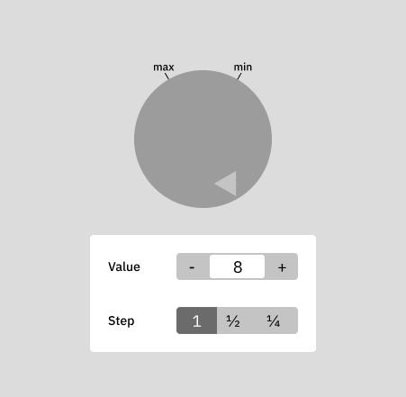

# Elm Exercise: Dial

Project to learn basic Elm by doing a simple project (see also [Learning Elm](#learning-elm) section below for information about the language).

**NOTE**: Make sure you read the [Elm Guide](https://guide.elm-lang.org) first before attempting this exercise.

## Goal

The idea is to create a dial that represents graphically a value within a range.

It should look something like this:

You are free to adjust the design (colors and shapes), but the overall idea should be the same.

## Features

The current dial doesn't do anything other than increasing a value without limits, you need to implement the following features:

- Reset button. Restores the value to the default value (of your choosing)
- Add a decrease button. Reduces the value by 1
- Add a max and min values (0 and 20 for example)
- Add a "step" that changes how the value changes when the + or - buttons are used
  - 1 -> The value changes by 1
  - 1/2 -> The value changes in steps of .5
  - 1/4 -> The value changes in steps of .25
- The rotation of the dial has to be in synch with the value (in relation to its min and max values)

### Bonus

- The + and - buttons are disabled when it max and min values are reached respectively
- Use an icon instead of text for the + and - buttons
- **Super bonus** Allow users to click on the dial and then drag (left and right) changing the value by a fix amount depending on the horizontal distance from the click.

### Notes

- The value is a float value
- The angular reference is: 0deg is North, 90deg is East
- Use inline SVG if you want to add more images

## Development

The project provides all the necessary packages. Running `npm install` should be enough to set up the project.

To run the project, just run `npm run start`.

## Learning Elm

### Official Docs

- [Syntax](https://elm-lang.org/docs/syntax) (make sure you read this first, esp. if you are not familiar with Haskell-like languages)
- [Differences with JS](https://elm-lang.org/docs/from-javascript)
- [Guide](https://guide.elm-lang.org)

### The Elm Architecture

- [Official explanation](https://guide.elm-lang.org/architecture/)
- [Alternative explanation](https://lucamug.medium.com/the-elm-architecture-tea-animation-3efc555e8faf)

### Books

- [Elm In Action](https://learning.oreilly.com/library/view/elm-in-action/9781617294044/) (O'Reilly)
- [Programming Elm](https://learning.oreilly.com/library/view/programming-elm/9781680507164/) (O'Reilly)
- [Functional Programming in Elm](https://functional-programming-in-elm.netlify.app/) (Website)
- [Practical Elm](https://korban.net/elm/book/) (Website)

### Other

- [Elm Examples](https://elm-lang.org/examples)
- [Try Elm](https://elm-lang.org/try)
- [Online editor](https://ellie-app.com/new) (similar to Code Sandbox)

## Tools

### Editor

Use VSCode for a better developer experience.

### Elm extension

**Warning**: The one that shows a wrench made of pieces, not the one that uses the Elm logo.

This tool provides inline error reporting, auto-import and automatic formatting.
